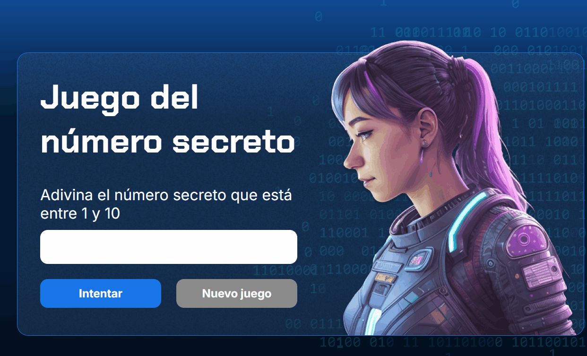

# Número Secreto 🔢🎤



An interactive web game where players try to guess the **secret number** using voice recognition and dynamic feedback.  
Built with JavaScript, HTML, and CSS while exploring browser speech recognition capabilities through the **Web Speech API**.

---

## ✨ Features

- 🎙️ Voice recognition input
- 🔢 Random secret number generation
- ⚡ Real-time feedback system
- 🚫 Input validation
- 📱 Responsive interface
- 🎮 Interactive gameplay experience

---


## 🛠️ Technologies Used

- HTML5
- CSS3
- JavaScript
- Web Speech API

---

## ⚙️ Installation & Usage

1. Clone the repository

```bash
git clone https://github.com/AleHdzB/Numero_Secreto.git
```

2. Navigate to the project folder

```bash
cd Numero_Secreto
```

3. Open the project

Open `index.html` in your preferred browser.

---

## 🎯 Learning Objectives

This project was developed to practice and improve skills in:

- JavaScript logic
- DOM manipulation
- Voice recognition integration
- Event handling
- Frontend web development fundamentals

---

## 🌱 Future Improvements

- Add difficulty levels
- Add score and timer system
- Add multilingual support
- Add animations and sound effects
- Improve mobile responsiveness

---

## 👨‍💻 Author

Developed by Alejandro Hernández

- GitHub: https://github.com/AleHdzB
- Repository: https://github.com/AleHdzB/Numero_Secreto

---